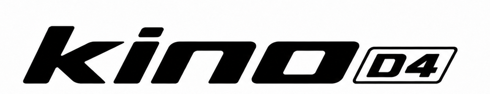
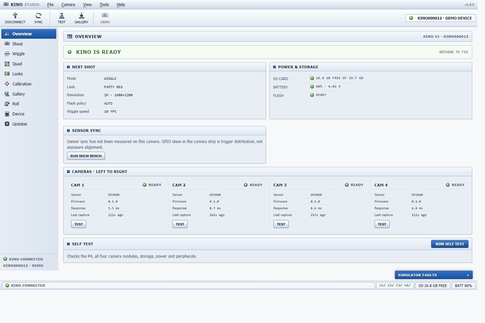
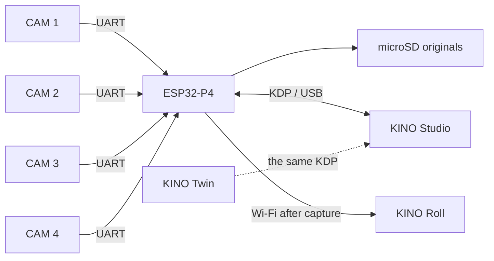

<div align="center">
  <picture>
    <source media="(prefers-color-scheme: dark)" srcset="docs/assets/brand/kino-d4-white-on-dark.png">
    
  </picture>

  <h3>Four cameras. One button. One moving photograph.</h3>

  <p>
    <a href="https://github.com/b5463/kino-d4/actions/workflows/ci.yml"></a>
    <a href="LICENSES/MIT.txt"></a>
    <a href="LICENSES/CERN-OHL-S-2.0.txt"></a>
  </p>

  <p>
    <a href="#try-studio">Try Studio</a> ·
    <a href="docs/HARDWARE.md">Hardware</a> ·
    <a href="firmware-contract/README.md">Firmware contract</a> ·
    <a href="https://github.com/users/b5463/projects/3">Project</a> ·
    <a href="docs/DEVELOPMENT.md">Build notes</a> ·
    <a href="docs/VERSIONING.md">Versions</a>
  </p>
</div>

KINO D4 is a handmade four-lens camera built for house parties. Press the shutter and four cameras fire from slightly different positions. The result can stay as four photographs or become a short, looping wiggle with real parallax.

Direct flash. 4:3 frames. Originals saved first. No cloud anywhere near the shutter.



<p align="center"><sub>The actual Studio overview, connected to the simulator that ships in this repository.</sub></p>

## Why this repository exists

A five-controller camera is miserable to service with an IDE, five serial logs, and hand-edited JSON. KINO Studio puts the whole machine behind one USB cable: all four sensors, power, storage, recipes, calibration, firmware, logs, and recovery.

The repository contains that workbench, the wire protocol it speaks, the Roll backend used after capture, shared document schemas, and a reference camera that can fail on command.

> **Honest build status:** Studio, KDP, schemas, test fixtures, the Roll backend with workers, the public Roll client, and KINO Twin work today against the simulated device. Physical D4 firmware and measured hardware dimensions are not shipped yet; everything hardware-gated is marked as such.

## Try Studio

You need Node.js 22 or newer.

```bash
npm ci
npm run dev -w @kino/studio
```

Open the local address printed in the terminal, then choose **OPEN DEMO DEVICE**. The simulator exercises the full camera UI without hardware. A physical D4 needs desktop Chrome or Edge for Web Serial.

Run the checks:

```bash
npm run lint
npm run test -w @kino/studio -w @kino/kdp -w @kino/schemas -w @kino/test-fixtures
npm run build
```

The API also needs PostgreSQL, Redis, and S3-compatible storage. Its local stack and ports are documented in [the development guide](docs/DEVELOPMENT.md#api-stack).

## What comes out of the camera

### WIGGLE

Four matched frames play `1 → 2 → 3 → 4 → 3 → 2`. Nothing is synthesized between them. The movement comes from the four real viewpoints.

### QUAD

Each camera can use a different recipe on the same shutter press. A single capture might produce PARTY NEG, MOTION, RAW DIGI, and ACROS-ISH together.

Both modes obey the same boring, important rule: the microSD card gets the originals before anything is rendered, uploaded, cropped, or shared. Derivatives are disposable. Originals are not.

## The camera

| Part | D4 V1 hardware |
|---|---|
| Main unit | Guition JC4880P443C-I-W, ESP32-P4 + ESP32-C6, 4.3-inch 480 × 800 touch display |
| Camera row | 4 × Seeed XIAO ESP32-S3 Sense |
| Sensors | 4 × OV3660 rolling-shutter sensors, up to 2048 × 1536 |
| Storage | 32 GB microSD |
| Battery | 1S 3000 mAh LiPo |
| Flash | 3 W CRI90 natural-white LED with constant-current driver |
| Sound | 8 Ω / 2 W speaker |
| Camera wiring | Four UART pairs plus one shared sync line |

The boards are ordinary, replaceable parts. The exact power limits, wire gauges, battery constraints, mechanical stack, and confidence level of every measurement live in [`docs/HARDWARE.md`](docs/HARDWARE.md).

## One cable, five controllers



Feature code in Studio never reaches around the device API to poke a serial port. Real hardware, the test camera, and KINO Twin all go through the same framing, CRC checks, timeouts, commands, and capability negotiation.

That boundary matters. A simulator that gets special treatment is only a mockup. A simulator that speaks the real protocol can expose real bugs.

## The hard part is time

A shared GPIO edge does not make four rolling shutters expose at the same instant. KINO keeps three different measurements separate:

| Measurement | What it actually tells us |
|---|---|
| GPIO distribution skew | When each camera node handled the trigger |
| VSYNC phase skew | Where each sensor was in its rolling frame cycle |
| Effective exposure skew | When the scene was recorded |

A trigger spread under 100 µs can still hide 10 to 30 ms between real exposures. Studio reports the three values separately. If firmware cannot measure one of them, it returns `null` and says why.

## Repository map

| Path | Owns |
|---|---|
| [`apps/studio`](apps/studio) | Camera setup, shooting, looks, media, firmware, recovery, diagnostics |
| [`apps/api`](apps/api) | Rolls, authentication, uploads, object storage, live events |
| [`apps/worker`](apps/worker) | Derivative jobs, recaps, exports, trash purge |
| [`apps/roll-web`](apps/roll-web) | Public Roll guest PWA and private host dashboard |
| [`apps/twin`](apps/twin) | KINO Twin: 3D assembly, simulation, measurement, engineering exports |
| [`packages/kdp`](packages/kdp) | The KINO Device Protocol: frames, CRC, commands, transports, request lifecycle |
| [`packages/schemas`](packages/schemas) | Versioned `kino.*` documents shared across processes |
| [`packages/test-fixtures`](packages/test-fixtures) | Reference camera, recipes, media, and injected failures |
| [`firmware-contract`](firmware-contract) | The contract camera firmware must implement |
| [`hardware`](hardware) | BOM, wiring, assembly, acceptance tests, and future CAD or PCB source |
| [`kino_dev_spec_pack`](kino_dev_spec_pack) | Permanent Studio and Roll product specifications |
| [`kino_twin_spec`](kino_twin_spec) | The 3D twin and virtual-device specification |

## Read the right thing

This project has history, and some old planning material is still useful. It is not always current. Start with [`docs/README.md`](docs/README.md), which says which source wins when code and prose disagree.

- [Hardware reference](docs/HARDWARE.md): parts, dimensions, power, wiring, and what still needs measuring
- [Architecture](docs/ARCHITECTURE.md): process boundaries, state ownership, uploads, and package relationships
- [Development](docs/DEVELOPMENT.md): setup, services, migrations, tests, and protocol changes
- [Troubleshooting](docs/TROUBLESHOOTING.md): browser, USB, protocol, power, sync, media, recovery, and API failures
- [Firmware contract](firmware-contract/README.md): the handoff extracted from working protocol source
- [Hardware build package](hardware/README.md): BOM, wiring, assembly order, and acceptance sheet
- [Contributing](CONTRIBUTING.md): required contracts, tests, measurements, and pull request rules
- [Roadmap](ROADMAP.md): current work and the deliberately unfinished edges
- [Releasing](docs/RELEASING.md): independent versions, compatibility review, artifacts, and publishing
- [Versioning](docs/VERSIONING.md): software, protocol, schema, database, and hardware revision rules
- [Security](SECURITY.md): private reporting and the high-risk surfaces
- [Brand assets](docs/assets/brand/README.md): the four split D4 marks and where each belongs
- [Product media](docs/assets/product/README.md): real and simulated asset rules plus the physical shot list

The short version: tested protocol source beats old prose, unknown hardware measurements stay unknown, originals are immutable, and firmware changes are finished only when the contract and tests move with them.

## License

KINO software and general documentation use the [MIT License](LICENSES/MIT.txt). Physical design source uses [CERN-OHL-S-2.0](LICENSES/CERN-OHL-S-2.0.txt), which keeps distributed hardware modifications open. Logos, wordmarks, product media, and the unaudited recovery archive remain reserved.

[`LICENSE`](LICENSE) explains the boundary, [`REUSE.toml`](REUSE.toml) records it for SPDX tooling, and [`TRADEMARKS.md`](TRADEMARKS.md) keeps compatible forks distinct from official KINO releases.
