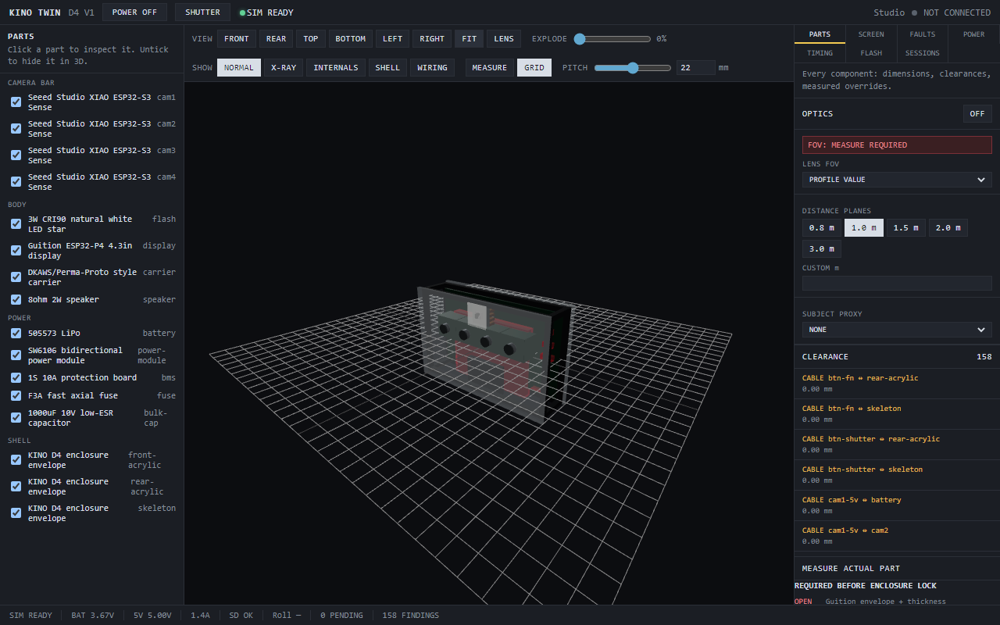
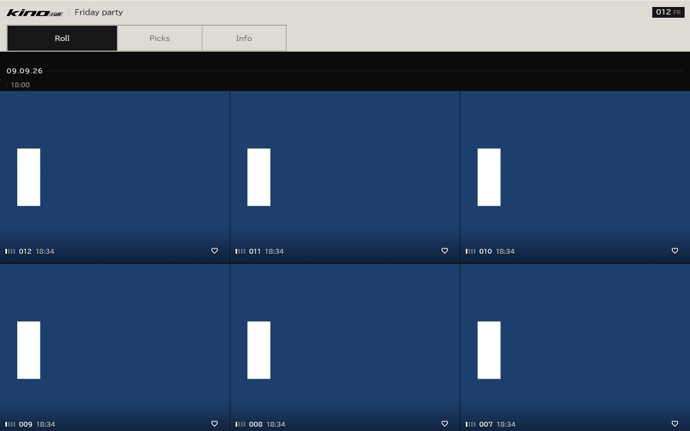
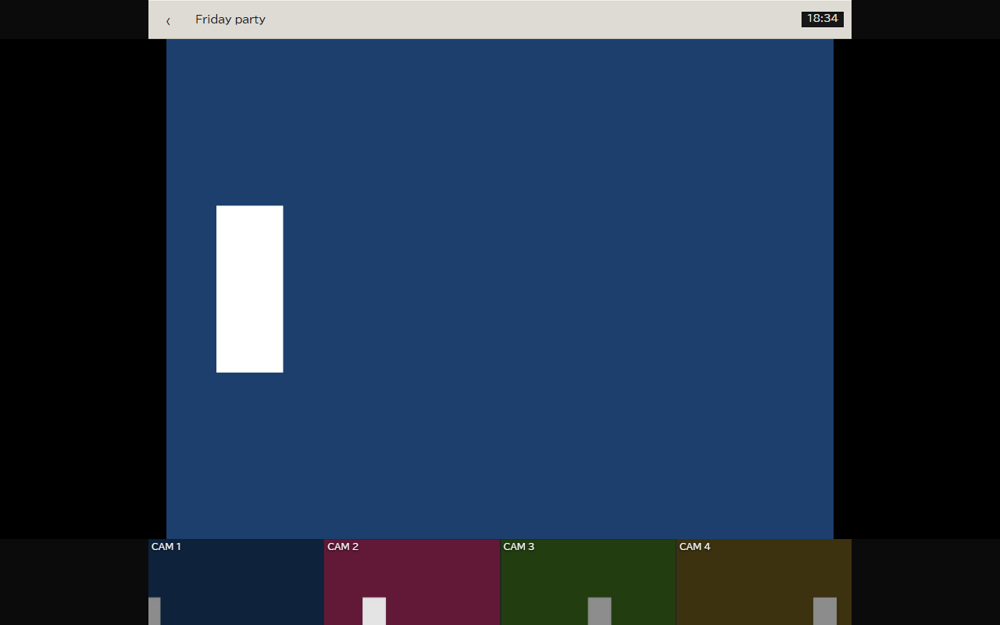
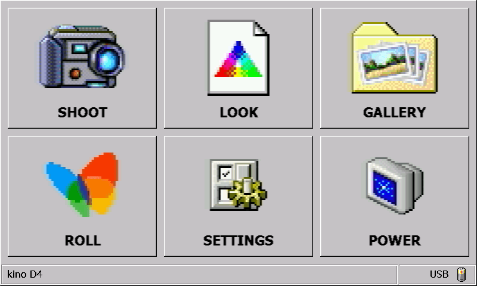
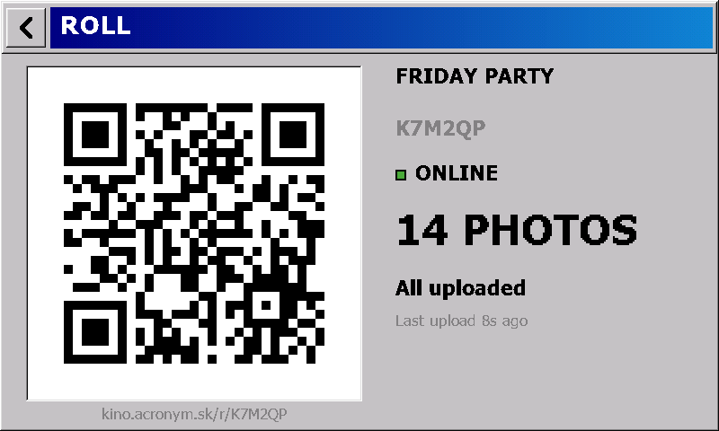
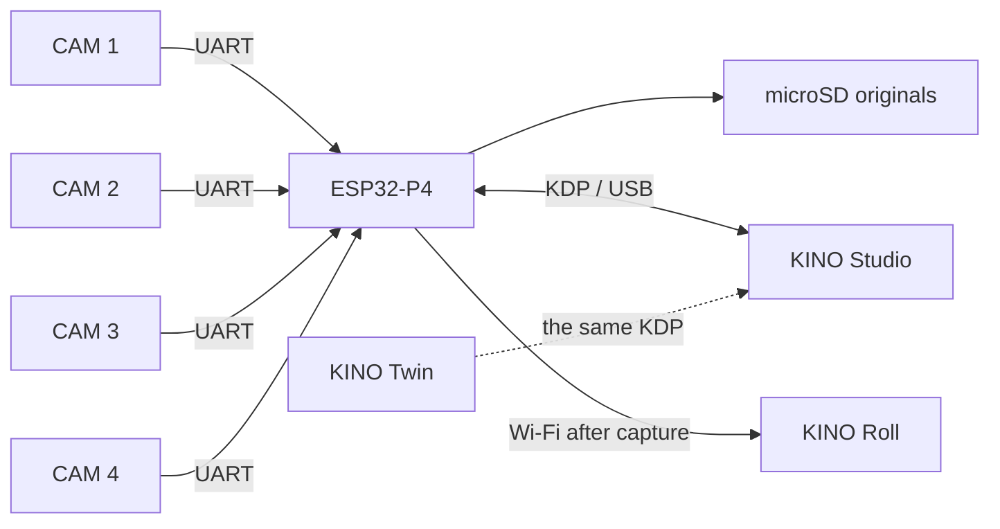

<div align="center">
  <picture>
    <source media="(prefers-color-scheme: dark)" srcset="docs/assets/brand/kino-d4-white-on-dark.png">
    
  </picture>

  <h3>Four cameras. One button. One moving photograph.</h3>

  <p>
    <a href="https://github.com/b5463/kino-d4/actions/workflows/ci.yml"></a>
    <a href="LICENSES/MIT.txt"></a>
    <a href="LICENSES/CERN-OHL-S-2.0.txt"></a>
  </p>

  <p>
    <a href="#try-studio">Try Studio</a> ·
    <a href="docs/HARDWARE.md">Hardware</a> ·
    <a href="firmware-contract/README.md">Firmware contract</a> ·
    <a href="https://github.com/users/b5463/projects/3">Project</a> ·
    <a href="docs/DEVELOPMENT.md">Build notes</a> ·
    <a href="docs/VERSIONING.md">Versions</a>
  </p>
</div>

KINO D4 is a handmade four-lens camera built for house parties. Press the shutter and four cameras fire from slightly different positions. The result can stay as four photographs or become a short, looping wiggle with real parallax.

Direct flash. 4:3 frames. Originals saved first. No cloud anywhere near the shutter.


<p align="center"><sub>The actual Studio overview, connected to KINO Twin — the simulated camera that ships in this repository.</sub></p>

## Why this repository exists

A five-controller camera is miserable to service with an IDE, five serial logs, and hand-edited JSON. KINO Studio puts the whole machine behind one USB cable: all four sensors, power, storage, recipes, calibration, firmware, logs, and recovery.

The repository contains that workbench, the wire protocol it speaks, the Roll backend used after capture, shared document schemas, and a reference camera that can fail on command.

> **Honest build status.** The software works against the simulated camera and is covered by tests that need no hardware. That is Studio, the protocol, the Roll backend and its workers, the guest client, and KINO Twin.
>
> There is a real camera now. Firmware 0.4.55 captures on all four cameras and writes the originals to the card. It draws its own screens. Since 0.4.4 it has uploaded to a Roll over Wi-Fi from the body itself. The body is released too: design 0.1.4, a printable PETG slab, measured rather than estimated.
>
> Three things are not finished, and it is worth naming them here rather than leaving a reader to find out.
>
> The camera has **no flash**. [`ECN-0003`](hardware/changes/ECN-0003-shutter-on-jp1-21.md) dropped the assembly and gave its enable pin to the shutter. A replacement module has not been chosen.
>
> **Exposure skew between the four cameras has never been measured.** That is the number the wiggle's quality actually rests on. Firmware reports the two skews it can observe and returns `null` for this one, with a reason.
>
> **There is no public front door yet.** The operator's line sits behind O2 carrier NAT, so `kino.acronym.sk` cannot point at the PC, and no ingress has been selected — see [the standing decision](docs/runbooks/public-ingress-options.md#standing-decision-2026-09-09). A party still works: the camera writes to its card first and uploads when it can.

## Try Studio

You need Node.js 22 or newer.

```bash
npm ci
npm run build -w @kino/studio -w @kino/twin
npm run preview:all
```

Open <http://localhost:4400/studio/>, then open <http://localhost:4400/dev/twin/> in a second tab and press **CONNECT KINO TWIN** back in Studio. KINO Twin is the simulated camera: it speaks the same protocol as hardware, so Studio exercises its full interface without a D4 on the bench.

Both apps must be served from one origin, as `preview:all` does — the bridge between them is a `BroadcastChannel`. To run them on separate dev servers instead, start `npm run twin:relay` and open Twin with `?ws=1`; Studio offers the bridge automatically in a dev build.

A physical D4 needs desktop Chrome or Edge for Web Serial.

Run the checks:

```bash
npm run lint
npm run test -w @kino/studio -w @kino/kdp -w @kino/schemas -w @kino/test-fixtures -w @kino/hardware-profiles -w @kino/simulator-engine -w @kino/three-assets -w @kino/twin -w @kino/design-system -w @kino/media -w @kino/roll-web
npm run build
```

That is every JavaScript suite that runs without Docker, and the same line CI runs. The API and worker also need PostgreSQL, Redis, and S3-compatible storage; their local stack and ports are documented in [the development guide](docs/DEVELOPMENT.md#api-stack).

Two suites are outside that line on purpose. The firmware's are C, built and run with `make -C firmware/p4/host_tests test-all` and `make -C firmware/components/kdp_core/host_tests` — 6,246 checks that need no camera, and the two that link cJSON need the IDF container. KINO Print's are Python (`npm run test -w @kino/print`), so a bare `npm test` at the root fails on a machine without Python.

## The three tools

Every screen below is a capture of the running application against the included simulator. No hardware was attached.

### KINO Studio

The workbench behind one USB cable: all four sensors, power, storage, recipes, calibration, firmware, logs, and recovery. Shown at the top of this page connected to KINO Twin.

### KINO Twin

A working 3D copy of the D4. It speaks the same KDP as real hardware: power it on, fire the shutter, watch the display, click any part for its dimensions and clearances. Measurement findings gate the enclosure lock.



<p align="center"><sub>KINO Twin, simulator powered on. Everything shown is simulated and labelled as such.</sub></p>

### KINO Roll

The shared album after the party. The camera uploads over Wi-Fi; guests open a link, watch photos arrive live, view the four frames behind each one, favourite and download. The client is a PWA that works on a phone at the event.

The host gets a separate surface on the same link: a dashboard that says which camera is uploading and which is stuck, hides or restores a photograph, clears the roll, and exports the lot as a ZIP. A roll can carry a PIN, and a trashed photograph stays recoverable for seven days. There is a third surface for a screen at the party — a projector page that cycles the newest captures and keeps the display awake.

The Roll is run for an event rather than hosted permanently: the origin is a laptop, reached through an outbound tunnel for the night, with no port forwarded. [`docs/runbooks/event-day.md`](docs/runbooks/event-day.md) is the procedure, and it ends by taking the tunnel down.



<p align="center"><sub>The guest gallery with demo captures from the test uploader.</sub></p>



<p align="center"><sub>One photo: the D4 frame strip switches the preview. Simulated captures.</sub></p>

### And one workshop tool

[KINO Print](apps/prusa-print-98/README.md) is not part of the camera. It is a local print host for the MK3S that prints the body, and it is here because the bodies in this repository kept failing on the bed for reasons a slicer does not warn about. It reads the PrusaSlicer metadata out of a `.gcode`, refuses to start until a person confirms the printer is physically clear, and streams the job itself. Its PETG preflight is the point: it catches a first layer that is too hot, full-temperature probing, a profile mismatch, and a nozzle that heats before the bed wait, then holds the nozzle at 170 °C through bed heating and mesh levelling and raises it just before the prime line. The source file is never modified.

## What comes out of the camera

### WIGGLE

Four matched frames play `1 → 2 → 3 → 4 → 3 → 2`. Nothing is synthesized between them. The movement comes from the four real viewpoints.

### QUAD

Each camera can use a different recipe on the same shutter press. A single capture might produce PARTY NEG, MOTION, RAW DIGI, and ACROS-ISH together.

Both modes obey the same boring, important rule: the microSD card gets the originals before anything is rendered, uploaded, cropped, or shared. Derivatives are disposable. Originals are not.

## The camera

| Part | D4 V1 hardware |
|---|---|
| Main unit | Guition JC4880P443C-I-W, ESP32-P4 + ESP32-C6, 4.3-inch 480 × 800 touch display |
| Camera row | 4 × Seeed XIAO ESP32-S3 Sense |
| Sensors | 4 × OV3660 rolling-shutter sensors, up to 2048 × 1536 |
| Storage | 32 GB microSD |
| Battery | 1S 3000 mAh LiPo |
| Flash | **Not fitted.** `ECN-0003` dropped the direct-flash assembly and gave its enable pin to the shutter; an external module will replace it and is not chosen |
| Sound | 8 Ω / 2 W speaker |
| Camera wiring | Four UART pairs plus one shared sync line |
| Body | Printed PETG slab, 131 × 90 × 65.5 mm, design 0.1.4 — two-part chassis, glued face shell, sliding lens cover, dovetail rear door |

The boards are ordinary, replaceable parts. The exact power limits, wire gauges, battery constraints, mechanical stack, and confidence level of every measurement live in [`docs/HARDWARE.md`](docs/HARDWARE.md).

Two printable bodies are released, and they are alternatives rather than versions of each other. [`KINO_FIELD_BODY`](hardware/cad/KINO_FIELD_BODY/README.md) is the one above: PETG on a desktop printer, support-free, and its release is gated by 82 automated checks over the actual meshes — that every part prints flat, and that both print jobs fit a 250 × 210 bed. [`KINO_RESIN_BODY`](hardware/cad/KINO_RESIN_BODY/README.md) is printed entirely through JLCPCB in three parts, with an MJF nylon skeleton carrying everything and a clear SLA shell that touches nothing electrical, so it can be reprinted in another colour without re-qualifying an optical dimension.

The camera knows when its cover is shut without a switch. The Hall sensor the shell used to be drilled for had to be fitted before the face shell was glued on — the one irreversible step in the assembly — so it is gone. Closed, all four lenses face an opaque plate 0.2 mm away; firmware reads a mean luminance off the frames the viewfinder already decodes and decides from all four together. It ships observing only: the two thresholds have to be read at the bench, because the sensors run auto-exposure and a covered one reports amplified noise rather than zero.

### The screen on the camera

The camera runs its own interface on the 4.3-inch panel. No phone, no laptop, nothing to pair. Six tiles: shoot, pick a look, browse the card, open a Roll, settings, power.



<p align="center"><sub>The home screen at 800 × 480. Drawn by the firmware's own code through <code>firmware/p4/host_preview</code> — not a photograph of the panel.</sub></p>

ROLL is the screen that matters at a party. It shows the QR a guest scans, the address for anyone who would rather type it, one word for the connection, and a count that comes from the card rather than from the server.



<p align="center"><sub>Also a firmware render. The roll name and code are invented for the render.</sub></p>

Both pictures come out of a program that compiles `ui.c` and draws the screens on a workstation. It renders 59 of them, including every failure state — a card that will not mount, a server that has stopped answering, a capture that saved three frames out of four. Looking at the interface used to mean a build, a flash and a serial capture; now it is one command:

```bash
make -C firmware/p4/host_preview && firmware/p4/host_preview/preview out/
```

## One cable, five controllers



Feature code in Studio never reaches around the device API to poke a serial port. Real hardware, the test camera, and KINO Twin all go through the same framing, CRC checks, timeouts, commands, and capability negotiation.

That boundary matters. A simulator that gets special treatment is only a mockup. A simulator that speaks the real protocol can expose real bugs.

## The hard part is time

A shared GPIO edge does not make four rolling shutters expose at the same instant. KINO keeps three different measurements separate:

| Measurement | What it actually tells us |
|---|---|
| GPIO distribution skew | When each camera node handled the trigger |
| VSYNC phase skew | Where each sensor was in its rolling frame cycle |
| Effective exposure skew | When the scene was recorded |

A trigger spread under 100 µs can still hide 10 to 30 ms between real exposures. Studio reports the three values separately. If firmware cannot measure one of them, it returns `null` and says why.

## Repository map

| Path | Owns |
|---|---|
| [`firmware`](firmware/README.md) | What runs on the camera: the ESP32-P4 application, the four camera nodes, the C6 radio image, and the host test suites |
| [`apps/studio`](apps/studio) | Camera setup, shooting, looks, media, firmware, recovery, diagnostics |
| [`apps/api`](apps/api) | Rolls, authentication, uploads, object storage, live events |
| [`apps/worker`](apps/worker) | Derivative jobs, recaps, exports, trash purge |
| [`apps/roll-web`](apps/roll-web) | Public Roll guest PWA and private host dashboard |
| [`apps/twin`](apps/twin) | KINO Twin: 3D assembly, simulation, measurement, engineering exports |
| [`apps/prusa-print-98`](apps/prusa-print-98/README.md) | KINO Print: the local USB print host that prints the body, with the PETG preflight that stops a bad job |
| [`packages/kdp`](packages/kdp) | The KINO Device Protocol: frames, CRC, commands, transports, request lifecycle |
| [`packages/schemas`](packages/schemas) | Versioned `kino.*` documents shared across processes |
| [`packages/test-fixtures`](packages/test-fixtures) | Reference camera, recipes, media, and injected failures |
| [`packages/media`](packages/media) | Wiggle sequencing and playback, shared by the worker and the clients |
| [`packages/design-system`](packages/design-system) | The shared interface vocabulary |
| [`packages/hardware-profiles`](packages/hardware-profiles) | Board and sensor profiles the simulator and Studio read |
| [`packages/simulator-engine`](packages/simulator-engine) | The device simulation behind KINO Twin |
| [`packages/three-assets`](packages/three-assets) | Geometry and materials for the 3D twin |
| [`firmware-contract`](firmware-contract) | The contract camera firmware must implement, and every recorded deviation from it |
| [`hardware`](hardware) | BOM, wiring, assembly, acceptance tests, two released printable bodies, and the Rev1 mainboard schematic |
| [`infra`](infra/README.md) | Compose files, the deploy script, backups, and the load and latency harnesses |
| [`kino_dev_spec_pack`](kino_dev_spec_pack) | Permanent Studio and Roll product specifications |
| [`kino_twin_spec`](kino_twin_spec) | The 3D twin and virtual-device specification |

## Read the right thing

This project has history, and some old planning material is still useful. It is not always current. Start with [`docs/README.md`](docs/README.md), which says which source wins when code and prose disagree.

- [Hardware reference](docs/HARDWARE.md): parts, dimensions, power, wiring, and what still needs measuring
- [Architecture](docs/ARCHITECTURE.md): process boundaries, state ownership, uploads, and package relationships
- [Development](docs/DEVELOPMENT.md): setup, services, migrations, tests, and protocol changes
- [Troubleshooting](docs/TROUBLESHOOTING.md): browser, USB, protocol, power, sync, media, recovery, and API failures
- [Firmware contract](firmware-contract/README.md): the handoff extracted from working protocol source, and every deviation the firmware is allowed
- [Firmware](firmware/README.md): what runs on the camera, how to build all three configurations, and what each host suite covers
- [Hardware build package](hardware/README.md): BOM, wiring, assembly order, and acceptance sheet
- [Field body](hardware/cad/KINO_FIELD_BODY/README.md) and [resin body](hardware/cad/KINO_RESIN_BODY/README.md): the two printable bodies, their measured inputs, and the gates each release passes
- [Running an event](docs/runbooks/event-day.md): the whole night, from bringing the stack up to taking the tunnel down
- [Restoring from backup](docs/runbooks/restore.md) and [what to watch](docs/runbooks/observability.md): the two things needed when a party is already underway
- [Host guide](docs/roll/HOST_GUIDE.md): the Roll dashboard, written for whoever is running the camera rather than for a developer
- [Contributing](CONTRIBUTING.md): required contracts, tests, measurements, and pull request rules
- [Roadmap](ROADMAP.md): current work and the deliberately unfinished edges
- [Releasing](docs/RELEASING.md): independent versions, compatibility review, artifacts, and publishing
- [Versioning](docs/VERSIONING.md): software, protocol, schema, database, and hardware revision rules
- [Security](SECURITY.md): private reporting and the high-risk surfaces
- [Brand assets](docs/assets/brand/README.md): the four split D4 marks and where each belongs
- [Product media](docs/assets/product/README.md): real and simulated asset rules plus the physical shot list

The short version: tested protocol source beats old prose, unknown hardware measurements stay unknown, originals are immutable, and firmware changes are finished only when the contract and tests move with them.

## License

KINO software and general documentation use the [MIT License](LICENSES/MIT.txt). Physical design source uses [CERN-OHL-S-2.0](LICENSES/CERN-OHL-S-2.0.txt), which keeps distributed hardware modifications open. Logos, wordmarks, product media, and the unaudited recovery archive remain reserved.

[`LICENSE`](LICENSE) explains the boundary, [`REUSE.toml`](REUSE.toml) records it for SPDX tooling, and [`TRADEMARKS.md`](TRADEMARKS.md) keeps compatible forks distinct from official KINO releases.
