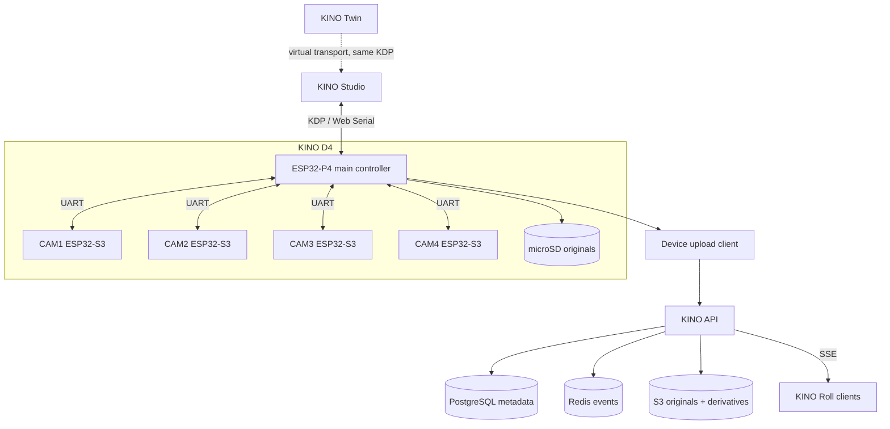

# KINO architecture

KINO has two operating worlds. The camera and Studio form a local instrument. Roll adds a server when photographs need to leave the room. The boundary stays sharp so a network failure cannot disable capture or service work.

## System map



## Local device path

Studio connects to the main controller through Web Serial. Boot noise is expected. The decoder scans for the KDP magic bytes, resynchronizes, performs a nonce handshake, then asks the device for identity, capabilities, configuration, camera status, power, storage, and network state.

Feature code never owns a serial port. It talks to `KinoProtocolClient` through a `Transport`:

```text
Studio page
  → device service
  → KinoProtocolClient
  → Transport
  → SerialTransport or simulator transport
  → KDP frame
```

This seam keeps the future Twin honest. A simulated device must obey the same framing, sequence IDs, timeouts, jobs, and capabilities as physical hardware.

## Shared package ownership

| Package | Owns |
|---|---|
| `@kino/kdp` | Frame encoding and decoding, CRC-32, command IDs, wire types, request lifecycle, timing vocabulary, serial and mock transports |
| `@kino/schemas` | Versioned portable documents for devices, configuration, captures, assets, firmware, and errors |
| `@kino/test-fixtures` | Reference device behavior, media fixtures, scenarios, recipes, and device audio |

Wire payloads and portable documents solve different jobs. KDP payloads live inside protocol frames and follow `PROTOCOL_VERSION`. Portable `kino.*` documents carry their own schema name and version. A field name that works on the wire may still be wrong in a stored document. The firmware contract records the known crossings.

## Studio state

Studio keeps three classes of state apart:

- Device truth: the latest value acknowledged or reported by KINO.
- Draft state: local edits that have not been applied.
- Transient state: connection attempts, transfers, calibration jobs, retries, and updates.

The Apply bar exists because draft state cannot masquerade as camera state. After a write, Studio reads back or waits for the device report before showing the value as saved.

## Capture path

The camera captures every original to microSD before network work begins.

```text
four sensor frames
  → central SD originals
  → optional preview
  → resumable upload
  → immutable S3 original keys
  → processing jobs
  → derived wiggle, thumbnail, metadata, export
```

Original keys live under:

```text
rolls/<rollId>/captures/<captureId>/original/cam-<NN>.jpg
```

Workers write under `derived/`. Completion streams the stored object back through SHA-256 before the asset becomes ready. Database uniqueness constraints, rather than preflight reads, enforce capture and asset idempotency under concurrent retries.

## Roll events

The API appends each event to a bounded Redis stream before publishing it live. Guests receive named Server-Sent Events. Reconnects carry `Last-Event-ID` and replay the missed stream range.

One subscriber connection serves all Roll guests in an API process. If that connection drops, the API closes the open SSE responses. Browsers reconnect and replay the gap instead of sitting on a healthy-looking socket that missed photographs.

## Repository map

```text
apps/
  api/                 Fastify API, migrations, auth, uploads, SSE
  studio/              React device workbench
  worker/              BullMQ media workers, derivative jobs
packages/
  kdp/                 protocol implementation
  schemas/             portable document schemas
  test-fixtures/       reference device and fixtures
firmware-contract/     firmware-facing contract
infra/                 local Postgres, Redis, MinIO
kino_dev_spec_pack/    product specifications
kino_twin_spec/        digital-twin specification and source data
docs/                  maintained guides, audits, historical plans
archive/               retained recovery material
```

## Current implementation line

The main branch contains Studio, the API foundation, media workers, shared contracts, local infrastructure, and broad tests. Derivative jobs run, but nothing recomputes a capture's stored status when a job finishes, so a fully processed capture still reads `processing`. The public Roll client and production Twin application are not present on this branch. Their specifications are detailed enough to guide implementation, but documentation must not describe them as shipped applications.

For exact protocol authority, start at [the firmware contract](../firmware-contract/README.md). For the hardware boundary, read [the hardware reference](HARDWARE.md).
