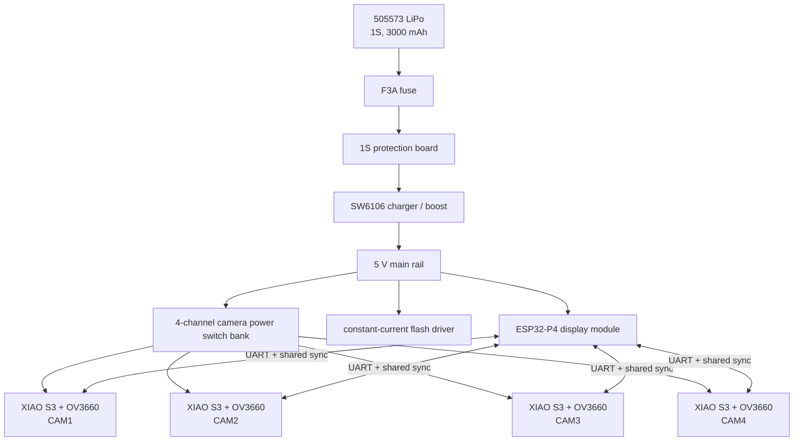

# KINO D4 V1 hardware

KINO D4 is a five-controller camera: one ESP32-P4 main unit and four ESP32-S3 camera nodes. The main unit owns the display, storage, controls, flash, power supervision, USB connection, and coordination. Each camera node owns one image sensor and its local capture work.

This page is a build snapshot. It separates verified component facts from measurements the finished enclosure still needs.

## Confidence labels

| Label | Meaning |
|---|---|
| `MEASURED` | Taken from the exact physical part with calipers or test equipment |
| `OFFICIAL_CAD` | Taken from a manufacturer CAD file |
| `OFFICIAL_SPEC` | Taken from a manufacturer drawing or data table |
| `SELLER_SPEC` | Supplied for the exact purchased part or listing |
| `PROVISIONAL` | A design estimate that still needs measurement |
| `CONFLICT` | Trustworthy sources disagree |

For enclosure work, prefer `MEASURED`, then `OFFICIAL_CAD`, `OFFICIAL_SPEC`, and `SELLER_SPEC`. Treat every `PROVISIONAL` or `CONFLICT` value as unfinished.

## Electrical shape



## Main controller and display

The current main module is the Guition `JC4880P443C-I-W`.

| Property | Value | Confidence |
|---|---:|---|
| Processors | ESP32-P4 + ESP32-C6 | `OFFICIAL_SPEC` |
| P4 clock | Up to 360 MHz, dual core | `OFFICIAL_SPEC` |
| Display | 4.3-inch IPS capacitive touch | `OFFICIAL_SPEC` |
| Resolution | 480 × 800 | `OFFICIAL_SPEC` |
| PSRAM | 32 MB | `OFFICIAL_SPEC` |
| Flash | 16 MB | `OFFICIAL_SPEC` |
| Active display area | 93.60 × 56.16 mm | `OFFICIAL_SPEC` |
| Supply | 5 V | `OFFICIAL_SPEC` |
| Reported module draw | About 320 mA | `OFFICIAL_SPEC` |
| Module envelope | 117.01 × 69.41 mm | `CONFLICT` |
| Alternate board envelope | About 114.40 × 66.80 mm | `CONFLICT` |

Measure the purchased board before locking the rear enclosure. Preserve access to both USB-C ports, the TF/microSD slot, speaker and battery connectors, the 2×13 header, and the UART/I2C connectors.

## Camera row

D4 uses four Seeed Studio XIAO ESP32-S3 Sense boards with their Sense expansion boards.

| Property | Per camera node |
|---|---|
| Board envelope | 21.0 × 17.8 × 15.0 mm, `OFFICIAL_SPEC` |
| Processor | ESP32-S3, up to 240 MHz |
| Memory | 8 MB PSRAM, 8 MB flash |
| Sensor | OV3660 |
| Maximum resolution | 2048 × 1536, about 3 MP |
| Shutter | Rolling, free-running |
| Link to main controller | Full-duplex UART |
| Sync | One separate shared trigger wire |

The four lenses sit on one rigid camera bar. Current pitch is adjustable from 20 to 24 mm with a 22 mm default. At 22 mm, provisional lens-center positions are `-33`, `-11`, `+11`, and `+33 mm` from the body center.

The field of view is still `MEASURE_REQUIRED`. OV3660 names the sensor. The lens and module determine the field of view.

## Timing and synchronization

The sensors run freely and expose with a rolling shutter. The shared trigger improves coordination but cannot certify exposure alignment by itself.

KDP keeps three values separate:

1. `gpioTriggerSkewUs`: distribution and handling of the shared edge.
2. `vsyncPhaseSkewUs`: sensor frame-phase separation.
3. `effectiveExposureSkewUs`: the best measurement or estimate of scene exposure separation.

The 100 to 400 µs figure is a trigger-distribution target. It is not a guaranteed exposure result. Firmware returns `null` and a reason when a timing value cannot be measured. Studio must preserve that uncertainty.

Host-side grading for effective exposure spread uses these bands:

| Spread | Grade |
|---:|---|
| Under 0.5 ms | Excellent |
| 0.5 to 1 ms | Very good |
| 1 to 2 ms | Good target |
| 2 to 5 ms | Warning |
| 5 to 10 ms | Poor for moving subjects |
| Over 10 ms | Fails the intended synchronized use |

## Battery and power

The current battery is a `505573` 1S LiPo rated at 3.7 V, 3000 mAh, and 11.1 Wh. The size-code proxy is roughly 5 × 55 × 73 mm. Measure the actual pouch, folds, lead exit, and foam clearance.

Seller-supplied limits for the fitted harness:

- 24 AWG power leads with a PH2.0-3P connector
- no more than 3 A sustained
- up to 6 A for a very short pulse
- 600 mA preferred charge current
- 1500 mA maximum charge current
- 26 to 28 AWG NTC lead

The 1S protection board is sold as 10 A. That number does not raise the camera's system rating. The battery harness remains the tighter sustained-current limit.

An F3A fast axial fuse sits near battery positive. The SW6106 carrier supplies the 5 V rail and supports an 18 W-class power-bank design. The exact purchased carrier is roughly 28 × 28 mm and about 11.36 mm high according to seller data. Measure it before final CAD.

## Camera power switching

Each camera has an independent high-side switch channel:

```text
P4 CAM_PWR GPIO high
  → 2N3904 on
  → P-channel MOSFET gate low
  → camera 5 V on
```

Current parts per channel:

- AO4407 or AO4407A P-channel MOSFET on a SOP8-to-DIP8 adapter
- 2N3904 NPN transistor
- 4.7 kΩ base resistor
- 100 kΩ gate pull-up
- 100 kΩ base-to-ground resistor recommended
- 1N5819 series Schottky diode

Bulk and local decoupling use 1000 µF 10 V low-ESR electrolytics and 100 nF 50 V ceramics.

## Flash, sound, storage, and controls

| Assembly | Current part |
|---|---|
| Flash emitter | 3 W CRI90 natural-white LED star, roughly 3.0 to 3.6 V forward voltage |
| Flash drive | Adjustable constant-current driver, 350 mA initial target |
| Flash thermal path | 20 × 20 × 7 mm copper pin-fin heatsink, 0.5 mm thermal pad |
| Flash diffuser | 1 mm opal acrylic |
| Speaker | 8 Ω, 2 W, about 25 × 35 mm face, 1.25 mm 2-pin plug |
| Central storage | SanDisk Ultra microSD, 32 GB |
| Buttons | 6 × 6 × 4.3 mm tactile switches |
| Mode control | MSK-22D14 SPDT slide switch, logic only |

The LED driver may advertise more current. D4 begins at 350 mA. A later 500 mA test depends on measured rail sag and thermal behavior.

## Harnesses

Each camera uses one detachable PH2.0 4-pin harness:

```text
+5 V
GND
P4 TX → XIAO RX
P4 RX ← XIAO TX
```

One separate 28 AWG wire carries shared sync to each node. Main power uses 20 AWG silicone wire. Logic and signal wiring uses 28 AWG. Keep high current off thin perfboard traces.

The main controller connects to its carrier through a 26-pin, 2×13, 2.54 mm female-to-female IDC ribbon about 10 cm long. Keep pin 1 and red-stripe orientation visible. Respect the ribbon bend radius.

## Mechanical snapshot

The provisional enclosure is 126 × 80 × 36 mm. The intended construction uses a black PETG structural skeleton with 2 to 3 mm clear acrylic outer panels, M2 heat-set inserts, and exposed screws. Acrylic acts as skin and window material. It does not carry the camera bar.

The flash sits above the lens row and centers between CAM2 and CAM3. The 4.3-inch display faces out through the rear.

These values guide the digital twin. Physical measurement still decides the enclosure.

## Source trail

- [Twin source notes](../kino_twin_spec/SOURCES.md)
- [Twin component manifest](../kino_twin_spec/component-manifest.json)
- [Full Twin specification](../kino_twin_spec/KINO_TWIN_SIMULATOR_SPEC.md)
- [KDP command contract](../firmware-contract/commands.md)
- [Portable schema contract](../firmware-contract/schemas.md)
- [Platform overview](../kino_dev_spec_pack/01_PLATFORM_OVERVIEW.md)
