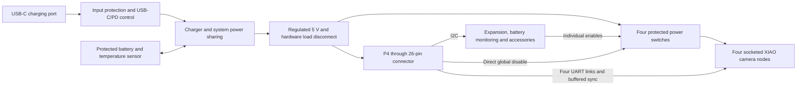

# KINO four-XIAO carrier — first-board proposal

Date: 2026-09-28; updated 2026-09-29. Status: **Requirements reference; NOT FOR FABRICATION.**

Implementation: [carrier A0 schematic and P4-sized placement study](../../kino-d4-carrier-a0/README.md). The carrier must now fit the P4 envelope and mount to its onboard inserts; this supersedes earlier outline-growth assumptions.

The user requested four XIAOs mounted directly on a carrier, a matching 26-pin P4 header, integrated charging, battery retention, and useful additions for the first PCB. The body and battery may change to accommodate it. On 2026-09-28 the user confirmed all six additional features below as first-board requirements, alongside the already confirmed IMU. This proposal refines the existing Phase 1 architecture; it is not an electrically complete schematic or routed PCB. See draft ECN-0007.

## First-board requirements

| Include | Purpose and implementation direction |
|---|---|
| Four replaceable XIAO ESP32-S3 Sense sockets | Two seven-position socket rows per node; retain each assembly mechanically. Preserve USB, reset/boot button, antenna and camera-flex access. |
| Matching 26-pin P4 connector | Keyed 2×13, 2.54 mm male box header for a short female-to-female IDC cable, with the measured JP1 numbering preserved. Exact part, shroud clearance and ribbon current rating remain to be selected. |
| USB-C charging and operation | Onboard charger with system power sharing, source-current limiting, battery temperature sensing and a regulated 5 V system supply. Charging while operating is a design target requiring attach/detach testing. |
| One shared removable battery | Power the P4 and all four cameras from one protected pack. A screwed-on insulated tray attaches to dedicated carrier/chassis mounts; the pouch must not bear on solder joints or hot power components. |
| Four protected camera power branches | Independently current-limit and restart a failed node; preserve GPIO31 as a direct global disable. Include fault feedback and staggered startup. |
| Battery fuel gauge | Report remaining charge and support graceful low-battery shutdown. Configure and validate against the selected cell. |
| Six-axis motion sensor — requested | Fit a combined three-axis gyroscope and three-axis accelerometer. ST LSM6DSOX is a candidate; final selection awaits bus, footprint and assembly review. Enables future horizon/orientation display and motion metadata. |
| Physical power and shutter controls | Edge power button, hardware forced-off path, and a shutter connector retaining JP1 pin 21. Provide an optional function-button connection through the expander. |
| Service access | Labelled rail/UART/sync test points, removable power links for current measurement, P4/C6 recovery access, and an accessible USB connector on every XIAO. |
| Expansion | One protected 3.3 V I2C accessory connector and labelled local XIAO breakout pads. Check shared-bus addresses and pull-ups before connecting accessories. |
| Visible diagnostics | Power/charge/fault indication with LEDs placed away from lens cavities; permit disabling nonessential LEDs. |

### Confirmed sensors and additions

The user confirmed the gyroscope for the first board. Use a combined gyro/accelerometer on I2C, with an address selected after the existing P4 bus is audited. Preserve access to its interrupt pins; do not consume a reserved P4 header pin for them. FIFO polling is a starting option for motion metadata, subject to measured bus bandwidth and timestamp accuracy. Wake-on-motion needs a separately designed always-powered sensor and wake path; it is not automatically available through a powered-off expander. Mount the sensor rigidly, mark its axes, keep it away from heat sources and board flex, and calibrate its relation to the camera axes. The IMU alone does not provide image stabilization or exposure-accurate motion data.

All six additions below are included in the first-board scope. Component and connector selection remains open; these are no longer optional feature reservations.

| First-board scope | Addition | Design implications |
|---|---|---|
| Include | Backed-up real-time clock | Preserve timestamps while the main battery is removed. RV-3028-C7 is a candidate; fit a compatible backup source and configure charging correctly for its chemistry. |
| Include | Lens-cover position sensor connection | Provide a connector for a Hall sensor and a serviceable sensor/magnet assembly in the new body. Old ECN-0004 removed the inaccessible glued-in arrangement. Automatic wake requires an always-powered wake circuit and remains a separate implementation decision. |
| Include | Four-channel camera current monitor | Measure each XIAO branch so abnormal consumption can be identified alongside UART status. Final shunts and monitor remain subject to layout review. |
| Include | Wired remote-shutter connector | Allow a cable release through a protected dry-contact input; preserve the existing physical shutter and do not expose the GPIO directly to a long unprotected cable. |
| Include | Separate PCB temperature sensor | Observe enclosure/power-zone temperature in addition to the battery thermistor. Set thresholds from measurements; the IMU's internal temperature is not a battery-temperature measurement. |
| Include | Haptic driver and motor connector | Fit the driver and connector, and include the matched motor in the enclosure assembly. Isolate vibration mechanically, allow feedback to be disabled, and suppress it during exposure; a motor is not driven directly from a GPIO. |

Do not depict unselected footprints as ready for population. All added functions require firmware and validation.

Reserve a connector position for a future external light/flash module. Its electrical interface and exposure timing remain undefined; a slow I2C output is not a precision flash trigger. JP1 pin 21 remains the shutter input. Sensor FSIN is not exposed by simply adding a XIAO socket.

Charger telemetry, a fuel gauge, individual branch faults and four-channel camera current measurement are required. The separate total-power monitor remains optional, subject to board area and cost; it was not one of the six approved additions.

### Connection budget for the confirmed additions

Use the existing I2C pair on JP1 pins 23/25 for the IMU, RTC, camera current monitor, board temperature sensor and haptic driver, alongside power management. Exact device addresses, bus loading and power-domain isolation must be checked before schematic release. Hardware provisions for a bus switch or a second expander can be added if the selected parts require them; this is not a reason to reassign reserved JP1 pins.

The following is a proposed 16-bit expander allocation, not a released netlist. P00–P07 and P10–P17 identify expander ports, not P4 GPIO numbers.

| Expander ports | Proposed use | Reset/operating requirement |
|---|---|---|
| P00–P03 | Four camera enables | External pull-downs keep branches off during reset; AND with direct GPIO31 global enable. |
| P04–P07 | Four camera fault inputs | Pull-ups terminate in the correct power domain. |
| P10 | Cover position input | Protected connector input; switch-on readings must not trigger an unintended photo. |
| P11 | Power-button shutdown request | Software polls the latched/held request; hardware forced-off remains independent. |
| P12 | Software power-off command | Drive through the power-controller interface with a defined inactive reset state. |
| P13 | Function-button input | Connector provision; debounce in firmware. |
| P14 | IMU latched status/interrupt | Optional status routing for polling; not an exposure timestamp or an always-on wake path. |
| P15 | RTC latched status/interrupt | Optional status routing for polling; RTC time remains readable over I2C. |
| P16–P17 | Spare control/status | Leave accessible for schematic-stage needs; no default external drive. |

The remote shutter can join the existing JP1 pin 21 shutter signal through a protected open-drain interface. A wired-OR arrangement gives local and remote release the same debounce/capture behaviour, but does not identify which one was pressed. A separate remote-status input can use a spare expander port if later needed. The connector is for a passive contact closure; compatibility with powered or legacy high-voltage accessories is not implied.

The haptic driver is controlled over I2C. Any additional hardware enable must have an inactive reset default and can use a spare expander output. Reserve motor peak-current allowance and local decoupling in the revised power budget; the previous 4.9 W/13 W estimates do not yet include the confirmed additions. Delay haptic feedback until capture is complete and establish a settling interval before the next exposure by measurement.

### Acceptance for the added features

- IMU: verify axes and calibration against the camera body; confirm sustained reads do not disrupt camera traffic or other I2C devices.
- Clock: set/read time, remove the main battery, verify backup operation and check time after reconnection; flag invalid time if backup is exhausted.
- Cover sensor: detect open/closed throughout mechanical tolerances and while the scene is dark; define unplugged-sensor behaviour. Test automatic wake separately if implemented.
- Camera currents: compare all four channels against an instrument, check offsets and startup peaks, and confirm a disabled branch is not back-powered.
- Remote shutter: verify local, remote and simultaneous presses, debounce, cable insertion and reset with the contact held closed; insertion alone must not take a photo.
- Board temperature: compare readings to an external probe during the thermal test and validate firmware responses. Battery charging still uses the independent battery-temperature safety loop.
- Haptics: verify startup silence, user disable, motor fault behaviour, rail stability and no vibration during the capture/settling window.

These checks are also tracked in the carrier-additions section of `RELEASE_CHECKLIST.md`.

## Electrical arrangement

All signals use 3.3 V logic. The camera branches originate on the carrier; their supply current must not travel to the P4 and back through the IDC ribbon. P4 power uses JP1 pins 2 and 4 with the specified ground returns. Never distribute raw USB-PD voltage or raw battery voltage onto JP1's 5 V pins.

Candidate power architecture remains an STUSB4500 PD sink, BQ25798 charger, and TPS61288L boost stage. A 9 V/2 A input contract is a starting target, with compliant 5 V fallback. Add a real load-disconnect function for hardware off: disabling a boost converter alone must not be assumed to isolate its output. Final parts, passive values, sequencing and thermal layout are unresolved.

USB power on the P4 or a XIAO must not backfeed the carrier or another USB source. Provide verified power isolation and service disconnects. Reverse blocking in a camera switch alone does not establish safe sharing of the XIAO's own USB VBUS node. The stock XIAO battery chargers remain unused; do not connect the common battery to the four XIAO battery pads.

UART and sync interfaces need hardware isolation when either board is unpowered, including when a XIAO is powered from its own USB port. Use appropriately specified partial-power-down buffers or switches with enables qualified by rail state. Preserve GPIO34's reset strap with a high-impedance input and no external bias. Ordinary series resistors alone are not power isolation.

## Header allocation

The source is the measured JC4880P443C-I-W map in ECN-0002, amended by ECN-0003 and the current firmware header. Do not substitute the pinout of another Guition P4 board. Pin numbers below are electrical positions, not a drawing of the cable's rear view.

| JP1 | Carrier connection |
|---:|---|
| 1, 3 | P4 3.3 V sense/service only; do not join to carrier 3.3 V |
| 2, 4 | Regulated, protected 5 V supply to P4 |
| 5, 6, 16 | Ground returns |
| 7 | P4 GPIO52 TX → CAM1 D7/RX |
| 8 | CAM3 D6/TX → P4 GPIO33 RX |
| 9 | CAM1 D6/TX → P4 GPIO51 RX |
| 10 | P4 GPIO31, global camera enable |
| 11 | P4 GPIO50 TX → CAM2 D7/RX |
| 12 | P4 GPIO30 TX → CAM4 D7/RX |
| 13 | CAM2 D6/TX → P4 GPIO49 RX |
| 14 | CAM4 D6/TX → P4 GPIO29 RX |
| 15 | GPIO35 boot strap: no connection beyond connector pad |
| 17 | P4 GPIO34 TX → CAM3 D7/RX; preserve reset strap |
| 18 | C6 3.3 V service sense only |
| 19 | P4 GPIO32, buffered sync → each XIAO D1/GPIO2 |
| 20, 22 | C6 programming UART, service access only |
| 21 | GPIO28, active-low shutter switch to ground |
| 23, 25 | Shared I2C SDA/SCL for carrier peripherals |
| 24, 26 | C6 boot/enable service pads; no default drive or added pull |

This accounts for all 26 contacts. It deliberately does not turn every contact into a general-purpose output.

## Access to XIAO pins

All 14 standard edge contacts land in sockets. Each node has its own breakout pads; spare signals are not wired together across nodes or directly to the P4.

| XIAO contacts | Use |
|---|---|
| 5V, GND | Protected local branch power and ground |
| 3V3 | Local node output/test access only; never parallel four regulator outputs |
| D1 / GPIO2 | Buffered camera sync |
| D6 / GPIO43, D7 / GPIO44 | Dedicated UART to P4 |
| D0, D3, D4, D5 | Local expansion pads; firmware assigns future uses |
| D2 / GPIO3 | Labelled strap-sensitive expansion pad; do not bias during reset |
| D8, D9, D10 | Breakout access, but shared with Sense-board SD SPI; not unrestricted spare GPIO |

D11/D12 and reset/boot are not extra contacts in the two seven-position rows. Optional access needs a verified interposer or service-contact arrangement; GPIO41/42 are shared with the Sense microphone. Do not promise access to every ESP32-S3 pin through the standard sockets. The P4 can control future node functions over firmware commands on the existing UART links.

## Battery and current budget

Use a single-cell 4.2 V-full Li-ion/LiPo pack as the starting architecture. A documented 4000–5000 mAh pack is a capacity target, not a selected or fit-checked part. Require a documented discharge rating, protection circuit, temperature sensor, and connector/wiring ratings for the actual load.

The prior Phase 1 budget estimates about 4.9 W typical and 13 W during simultaneous capture. These are planning allocations, not measured limits. At 13 W, 3.0 V battery voltage and assumed 90% conversion efficiency, battery current is about **4.8 A**. Start the pack/harness down-selection at at least 5 A continuous capability, with additional margin selected from measured peaks and temperatures. A large mAh number alone does not establish adequate discharge capability.

The existing 505573 harness's stated 3 A sustained limit does not meet that planning case. If retained, load limits must be reduced and verified. Its recorded preferred charge current is 600 mA; do not inherit the old mainboard proposal's 1–1.5 A charge target without checking the chosen pack. All new charging settings must follow the actual cell/PCM/NTC data.

At 4.9 W, 4000–5000 mAh at 3.7 V nominal and an assumed combined 80% usable-energy/conversion factor gives roughly **2.4–3.0 hours**. Actual runtime depends on measured load and cutoff. A 9 V/2 A source also cannot guarantee maximum system power and maximum charging simultaneously; reduce charging as operating demand rises.

## Physical concept

Start with one row of four cameras on the existing 22 mm optical pitch. That puts the outer optical centres 66 mm apart. Socket locations must be derived from the actual lens-to-board offset and orientation, not by assuming the lens is at the XIAO centre.

The carrier must fit within the Guition P4 module envelope. The A0 uses the manufacturer-dimensioned 117.01 × 69.41 mm outline and the inner M2 insert pattern, 61.9 × 54.8 mm, with a drawing-derived -9.3 mm X offset. Do not substitute the outer case screw pattern. Keep four layers. Resolve socket bodies, flexes, USB access and battery retention within this outline and the revised stack depth; see A0 MECHANICAL.md for fit limits.

Place camera sockets on the lens-facing side, charging components near the USB-C edge, and battery retention on the opposite side only where the P4, through-hole tails and thermal clearances permit. Keep converter heat out of the battery contact area. Set the enclosure depth from measured socket and assembled camera heights; do not reuse the old Dupont-wire clearance as a socket dimension. Optical mounts should absorb insertion and handling forces without bending the PCB.

## Work needed before an order

1. Select exact sockets, IDC header/cable, USB-C connector, battery and battery connector; obtain drawings and cell limits.
2. XIAO row centres are verified from official Seeed files at 15.24 mm. Verify the physical socket fit, stack height, lens offsets and P4 mounting/header clearance. Resolve the battery tray and enclosure together.
3. Complete component-level schematics, protection/sequencing design and I2C address/pull-up review, including powered-off bus isolation.
4. Implement firmware for the new charger, gauge, branch controls and graceful shutdown. Existing GPIO compatibility does not imply the added devices already work.
5. Complete footprints and PCB routing; run electrical/design-rule checks, review current paths and produce assembly/fabrication outputs.
6. Order prototype boards after the design review; test inrush, simultaneous capture, brownout, USB insertion/removal, charging, faults and enclosure temperatures before a production order.

No fabrication files were generated for this proposal, and no physical tests were performed.

## References

- Local sources: `docs/HARDWARE.md`, `firmware/p4/main/board_d4v1.h`, ECN-0002, ECN-0003, and `PHASE_1_ARCHITECTURE.md` in this directory.
- [Seeed XIAO ESP32-S3 hardware documentation](https://wiki.seeedstudio.com/xiao_esp32s3_getting_started/): socket signals, shared SD/microphone pins and power-pin behaviour.
- [TI BQ25798](https://www.ti.com/product/BQ25798): charger/system power-path candidate.
- [TI TPS61288 family](https://www.ti.com/product/TPS61288): 5 V boost candidate; silicon current capability is not a battery or board rating.
- [TI TPS2553](https://www.ti.com/product/TPS2553): adjustable current-limited branch-switch candidate.
- [TI TCA9539](https://www.ti.com/product/TCA9539): I2C control expansion candidate.
- [TI BQ27441-G1](https://www.ti.com/product/BQ27441-G1): fuel-gauge candidate, conditional on cell compatibility.
- [ST LSM6DSOX](https://www.st.com/en/mems-and-sensors/lsm6dsox.html): combined gyro/accelerometer candidate with I2C, FIFO and motion interrupts.
- [Micro Crystal RV-3028-C7](https://www.microcrystal.com/en/products/real-time-clock-rtc-modules/rv-3028-c7/): real-time-clock candidate with backup supply support.
